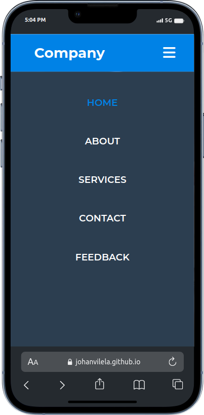

<h1 align="center">
  Simple Responsive Navbar
</h1>

<h4 align="center">
  A simple responsive navbar built only with HTML and CSS.
</h4>

  <a href="https://johanvilela.github.io/simple-responsive-navbar/" target="_blank">Demo</a> •
  <a href="#key-features">Key Features</a>

    
    

    

## Key Features

- Mobile First
- Only HTML & CSS
